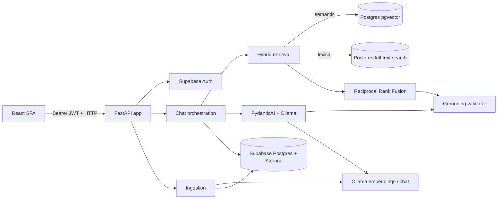

# Backend application — Document Copilot

Folder `app/` berisi aplikasi FastAPI untuk Document Copilot. Backend adalah batas
kepercayaan utama: browser hanya mengirim JWT dan permintaan pengguna, sedangkan
backend memverifikasi pengguna, mencari bukti, memanggil Ollama, memvalidasi sitasi,
dan menyimpan hasilnya.

Tujuannya bukan sekadar menghasilkan jawaban. Setiap jawaban faktual harus dapat
ditelusuri ke potongan dokumen yang benar-benar ditemukan untuk permintaan tersebut.
Jika bukti tidak cukup, sistem mengembalikan penolakan yang jelas, bukan tebakan.

## Arsitektur



Komponen penting:

- **FastAPI** adalah titik masuk HTTP dan SSE.
- **Supabase Auth** memverifikasi bearer token dan membatasi email ke domain yang
  diizinkan.
- **Supabase Postgres** menyimpan dokumen, chunk, thread, pesan, sitasi, dan metadata
  operasional. `pgvector` dan full-text search berjalan di Postgres yang sama.
- **Ollama** dipakai untuk embedding saat ingestion/query dan untuk menghasilkan
  jawaban terstruktur.
- **PydanticAI** mengikat output Ollama ke model `GroundedAnswer`; validasi aplikasi
  tetap menjadi keputusan akhir sebelum hasil disimpan.

## Struktur folder

| Folder/modul | Tanggung jawab |
| --- | --- |
| `main.py` | Membuat FastAPI, CORS, request logging, dan mendaftarkan router. |
| `config.py` | Satu-satunya pembaca environment variable; seluruh konfigurasi berasal dari sini. |
| `api/` | Kontrak HTTP: upload/dokumen di `documents.py`, thread dan stream chat di `chat.py`. |
| `auth/` | Dependency `current_user` untuk memverifikasi JWT Supabase dan domain email. |
| `database/` | Model SQLAlchemy untuk migrasi dan query Postgres owner-scoped untuk dokumen/chat. |
| `ingestion/` | Membaca PDF, normalisasi, chunking, embedding, dan menyimpan chunk sampai siap dicari. |
| `retrieval/` | Query dense + PostgreSQL FTS, lalu penggabungan ranking dengan RRF. |
| `assistant/` | Konfigurasi PydanticAI, Ollama, instruksi sistem, dan prompt berbasis bukti. |
| `grounding/` | Model bukti/sitasi serta validator yang memastikan sitasi cocok dengan retrieval. |
| `chat/` | Orkestrasi satu turn chat dan encoding event Server-Sent Events. |
| `supabase.py` | Pembuatan client Supabase untuk operasi Storage/API yang membutuhkannya. |

## Pipeline ingestion dokumen

Pipeline ini berjalan setelah `POST /documents` menerima PDF yang valid.

1. Router memastikan tipe file, ukuran, dan header PDF valid.
2. Dokumen asli disimpan privat di bucket Supabase `documents`; record
   `source_documents` dibuat dengan status `uploaded`.
3. Background task memindahkan status ke `processing`, mengunduh file privat, lalu
   mengekstrak dan menormalisasi isi PDF.
4. `chunk_document()` membagi isi menjadi chunk stabil dengan posisi, halaman/seksi,
   offset sumber, jumlah token, dan metadata.
5. Setiap batch chunk dikirim ke endpoint Ollama `/api/embed`. Embedding dan metadata
   disimpan di `document_chunks`.
6. Postgres membangun `search_vector` dari teks chunk untuk full-text search, dan
   indeks HNSW melayani pencarian vektor.
7. Hanya setelah semua chunk/embedding tersimpan, status menjadi `ready`. Dokumen
   `uploaded`, `processing`, atau `failed` tidak pernah menjadi bukti chat.

Jika proses gagal, backend mencatat error teknis di log, menyimpan pesan aman untuk
pengguna, dan memberi status `failed` agar pemilik dapat menjalankan retry.

## Pipeline retrieval hybrid

`DocumentRetriever.search()` adalah satu-satunya pintu retrieval untuk chat.

```text
pertanyaan
  → embedding query melalui Ollama
  → top-N pgvector cosine search
  → top-N PostgreSQL full-text search
  → Reciprocal Rank Fusion (RRF)
  → top-K SourcePassage
```

Dua query dijalankan terpisah tetapi memakai filter yang sama:

- `source_documents.owner_id` harus milik pengguna saat ini;
- status dokumen harus `ready`;
- apabila pengguna memilih dokumen tertentu, chunk harus berasal dari daftar itu;
- embedding chunk wajib tersedia untuk jalur semantic.

Hasil dense dan lexical tidak dirata-rata berdasarkan skor. Skor cosine dan skor
full-text memiliki skala berbeda, sehingga backend menggabungkan **peringkatnya**
dengan Reciprocal Rank Fusion. Hasil yang muncul di kedua ranking memperoleh prioritas
lebih tinggi. Setelah itu backend mengambil teks chunk, nama dokumen, halaman, dan
seksi sebagai `SourcePassage`.

Tidak ada BM25, reranker, atau vector database terpisah. PostgreSQL full-text search
adalah jalur lexical yang dipakai proyek ini.

## Pipeline satu turn chat

Endpoint utama:

```text
POST /threads/{thread_id}/messages/stream
Authorization: Bearer <Supabase access token>
Content-Type: application/json
```

Body permintaan:

```json
{
  "content": "Bagaimana perubahan operating income AWS?",
  "document_ids": ["uuid-opsional"]
}
```

Alur eksekusi:

1. `current_user` memverifikasi JWT. Request tanpa token valid ditolak sebelum
   retrieval atau Ollama dipanggil.
2. `start_turn()` memastikan thread dimiliki pengguna. Thread asing dan thread yang
   tidak ada sama-sama terlihat sebagai `404` agar ID thread tidak bocor.
3. Pesan pengguna disimpan terlebih dahulu dengan state `running`, request ID, scope
   dokumen, dan waktu mulai.
4. `DocumentRetriever` mengambil bukti dari corpus yang diizinkan.
5. Jika tidak ada bukti, backend tidak memanggil Ollama. Ia langsung membuat jawaban
   standar *not enough evidence in the uploaded corpus*, tanpa sitasi.
6. Jika ada bukti, backend mengambil maksimal 12 pesan thread yang selesai sebagai
   konteks percakapan. Konteks ini hanya membantu memahami pertanyaan lanjutan; ia
   **bukan** bukti faktual.
7. `assistant/agent.py` membuat prompt yang berisi pertanyaan, konteks percakapan,
   serta chunk bukti lengkap dengan `chunk_id`, dokumen, lokasi, dan teks.
8. PydanticAI meminta Ollama menghasilkan `GroundedAnswer` terstruktur. Model tidak
   punya tool untuk menulis SQL atau mencari dokumen sendiri; seluruh bukti sudah
   dibatasi backend sebelum model dijalankan.
9. `validate_grounded_answer()` memastikan setiap sitasi mengarah ke chunk yang
   di-retrieve pada turn yang sama, nama dokumen cocok, lokasi cocok, dan kutipan
   benar-benar terdapat pada teks chunk.
10. Jika valid, satu transaksi Postgres menyimpan pesan asisten, baris sitasi, state
    selesai, metadata penggunaan, dan timestamp thread. Jika tidak valid, hasil
    asisten tidak disimpan.

## Prompt dan grounding

Instruksi model dibuat sempit:

- gunakan hanya evidence yang diberikan;
- setiap klaim faktual wajib memiliki sitasi;
- gunakan jawaban insufficient-evidence jika corpus tidak mendukung jawaban;
- jangan memberi rekomendasi beli, jual, atau tahan saham.

Prompt bukan satu-satunya perlindungan. Validator grounding adalah lapisan wajib yang
berjalan setelah model selesai. Model dapat membuat JSON yang valid tetapi tetap
ditolak jika mencoba menyebut chunk, halaman, seksi, atau kutipan yang tidak cocok.

## Streaming SSE

Endpoint chat mengembalikan `text/event-stream`. Frontend memakai `fetch` biasa agar
tetap dapat mengirim `POST` dan header bearer token; `EventSource` tidak dipakai.

| Event | Makna |
| --- | --- |
| `status` | Tahap `persisted`, `retrieving`, `generating`, atau `persisting`. |
| `answer` | Snapshot teks jawaban sementara dari structured output. Klien mengganti teks sementara dengan snapshot terbaru. |
| `citations` | Sitasi final, hanya dikirim setelah grounding valid dan data tersimpan. |
| `complete` | ID pesan pengguna, pesan asisten, dan request yang berhasil. |
| `error` | Kode serta pesan aman untuk kegagalan generation atau grounding. |

Structured output dapat berubah selama JSON belum selesai. Karena itu server mengirim
snapshot `answer`, bukan mengasumsikan setiap potongan selalu dapat di-append.

Apabila browser memutus koneksi atau task dibatalkan, `streamed.cancel()` dipanggil,
pesan pengguna ditandai `cancelled`, dan backend tidak menulis pesan asisten ataupun
sitasi yang terlihat sebagai jawaban selesai.

## Persistence dan kepemilikan

Semua query thread, pesan, dan sitasi di `database/chats.py` dibatasi oleh `owner_id`.
Ini berlaku bahkan untuk query melalui relasi `chat_messages`, `message_citations`,
dan `source_documents`.

Data yang disimpan pada `chat_messages.payload` dibatasi pada metadata operasional:

- request ID dan state (`running`, `completed`, `failed`, atau `cancelled`);
- scope dokumen dan waktu proses;
- model, durasi, jumlah chunk retrieval;
- jumlah request provider serta token input/output.

Backend tidak menyimpan bearer token, service-role key, header provider, atau prompt
lengkap yang telah diinjeksi evidence. Sitasi disimpan secara normalisasi di
`message_citations`: satu halaman menjadi satu row. Saat pesan dibaca kembali, row
tersebut digabung menjadi satu sitasi dengan `page_numbers`.

## Konfigurasi penting

Seluruh nilai dibaca dari `config.py`; lihat `backend/.env.example` untuk formatnya.

- `DATABASE_URL`: koneksi Postgres direct/session untuk Alembic dan query psycopg.
- `OLLAMA_BASE_URL`, `OLLAMA_CHAT_MODEL`: model chat PydanticAI memakai endpoint
  OpenAI-compatible `<base>/v1`.
- `OLLAMA_EMBEDDING_MODEL`, `OLLAMA_EMBEDDING_DIMENSIONS`: dipakai ingestion dan
  query retrieval melalui endpoint Ollama `/api/embed`.
- `CHAT_HISTORY_MESSAGE_LIMIT`: jumlah pesan selesai yang dapat dipakai sebagai
  konteks percakapan; default `12`.
- `CHAT_MAX_OUTPUT_TOKENS`: batas output jawaban Ollama; default `2048`.
- `RETRIEVAL_*`: batas candidate, hasil akhir, dan bobot RRF.

Jangan membaca environment variable langsung dari route atau service baru. Tambahkan
nilai ke `Settings` di `config.py` lebih dahulu.

## Cara memverifikasi perubahan backend

Dari folder `backend/`:

```bash
uv run pytest -m "not integration"
uv run ruff check .
```

Test unit memakai fake di batas database, retrieval, dan agent sehingga tidak
membutuhkan koneksi Supabase atau Ollama. Integration test nyata tetap diperlukan
untuk memverifikasi konfigurasi Supabase dan model Ollama pada environment tujuan.
